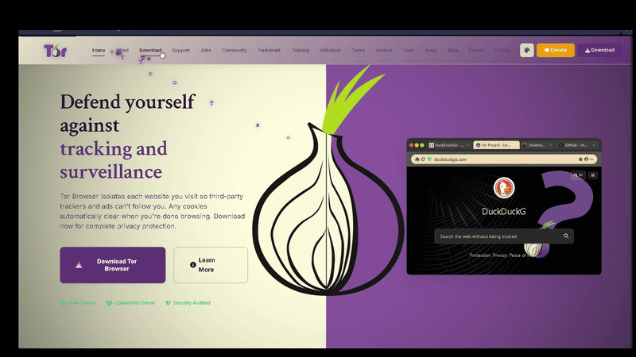

  <!-- Logo div -->
  

    
  

  <!-- Text div -->
  

    <a href="https://www.torproject.org/" target="_blank" style="text-decoration:none; color:#fff;">
      Click to view Tor Project Website
    </a>
  

  

  <!-- GIF Demo: Local offline file -->
  

---

## ℹ️ Note

> **This site was built by me just for my SEO practice.**  
>  *for my own SEO learning and practice purposes only.*

<!-- SEO Badge Set - with Icons and Short Formats -->

  
  
  
  
  
  
  
  
  
  
  
  
  

---

## 🚀 Why This The-Tor?

## 🎨 Thems 

|  | Color      | 
|--|------------|
| 🟪 | `#7d5fff` |     
| 💜 | `#8d72e1` | 
| ⚫ | `#222226` | 
| 🤍 | `#ececff` |
| 🟩 | `#a4f86e` | 
| 🟡 | `#ffd34e` | 

---

> ⚠️ **Important Notice**  
> This website is currently optimized for **desktop and laptop devices**.  
> Mobile and other operating system optimization is approximately **45% complete**.  
> For the best experience, please access this site on a **desktop or laptop**.

---

## 🚀 Platform Download Center

|    **Windows** |    **macOS** |    **Linux** |    **Android** |
|:---:|:---:|:---:|:---:|
| [Download .exe](https://shubham-shipt.github.io/Tor-Project/src/download.html) | [Download .dmg](https://shubham-shipt.github.io/Tor-Project/src/download-mobile.html) | [Download .AppImage](https://shubham-shipt.github.io/Tor-Project/src/download.html) | [Download APK](https://shubham-shipt.github.io/Tor-Project/src/download-mobile.html) |

---

## 🌐 Live Tor Network Stats

|  Relays |  Exit Relays | 🌉 Bridge Relays |  Daily Users |
|:--------------------:|:-------------------------:|:--------------------------:|:-----------------------------:|
| **5,000+**           | **2,000+**                | **1,000+**                 | **1,700,000+**                |

---

## ✨ GUI Innovations

-  **Animated  :** SVG-morphing icons, glow effects, onion pulse.
-  **Glass Cards:** Layered with, interactive hover.
-  **GPU Acceleration:** Instant, smooth transitions.
-  **Download Cards:** Animated OS icons, bouncy on click.
-  **Live Stats:** Data widgets update in real time.
-  **Newsletter:** Animated mail icon, glassy subscribe bar.
-  **Theme Switcher:** Instantly swap between purple, , and dark glass themes.

---

---

## 🤝 Join the Project

- 🍴 Fork & star to !
- 💜 Suggest, design, or code a new module, icon, or UI pack.
- 💬 Open issues for ideas, feedback, or collab.

---

## 👤 Author & Links

- **Author:** [shubham-shipt](https://github.com/shubham-shipt)
- **Live view:** [shubham-shipt.github.io/The-Tor-INC/](https://shubham-shipt.github.io/Tor-Project/)

---

## 📝 License

Private for now. Contact the author for collaboration or licensing.

---

> 
<i>
> “Guard your world, silently.” 
> “A shield you’ll love to use.” 
> <b> Welcome to The-Tor.</b> 
> </i>

